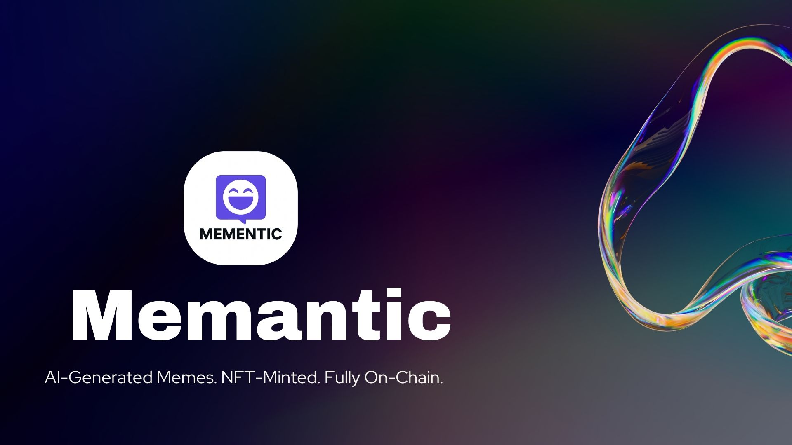
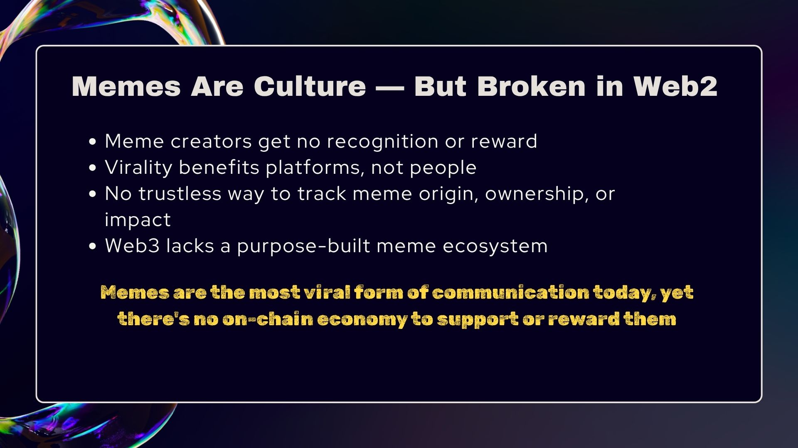
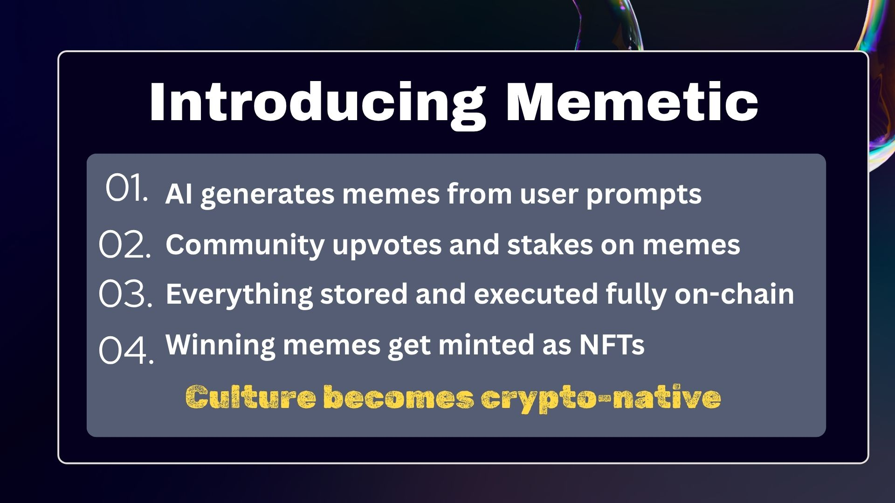
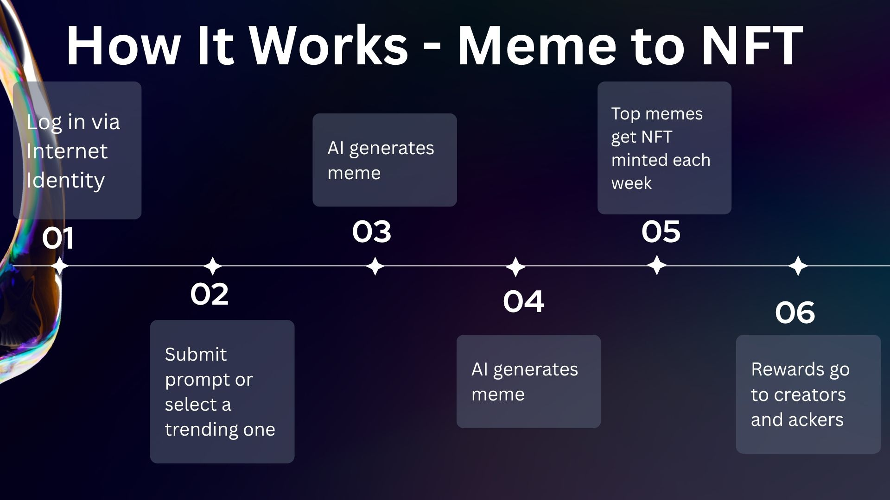
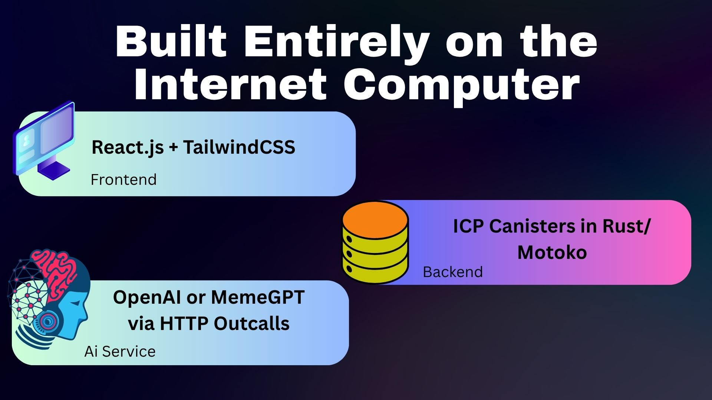
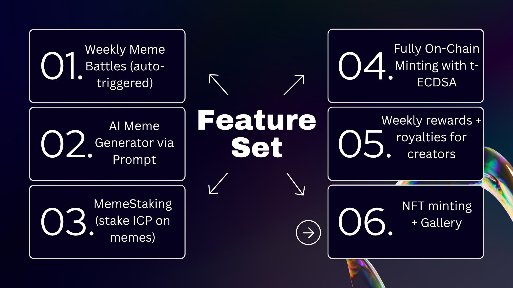
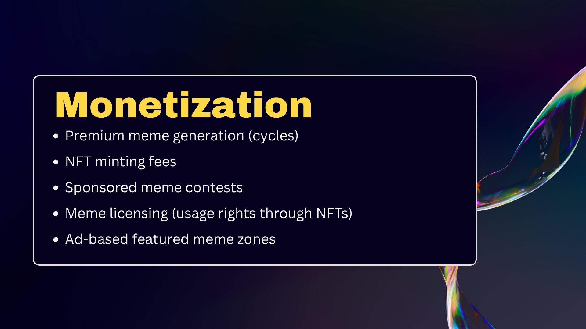

# Mementic Project Overview


## Index
- [Mementic Project Overview](#mementic-project-overview)
  - [Index](#index)
  - [Introduction - Built for creators. Powered by culture. Minted on-chain.](#introduction---built-for-creators-powered-by-culture-minted-on-chain)
  - [How It Works](#how-it-works)
  - [Tech Stack](#tech-stack)
  - [On-Chain Architecture](#on-chain-architecture)
  - [Features](#features)
  - [Monetization](#monetization)
  - [Roadmap](#roadmap)
  - [Team](#team)
  - [Submission Summary](#submission-summary)
  - [Prerequisites](#prerequisites)
  - [Running the project locally](#running-the-project-locally)
    - [Quick Setup (Recommended)](#quick-setup-recommended)
    - [Manual Setup](#manual-setup)
    - [Environment Variables](#environment-variables)
    - [Note on frontend environment variables](#note-on-frontend-environment-variables)
  - [Contributing](#contributing)
- [Mementic](#mementic)


## Introduction - <u>Built for creators. Powered by culture. Minted on-chain.</u>



Mementic is a Web3-native platform that uses AI to generate memes and mints top-rated content as NFTs.

## How It Works

Users submit prompts, generate memes via AI, vote or stake ICP on the best ones, and earn when memes go viral.

## Tech Stack

Built on Internet Computer (ICP) using React for frontend, Rust/Motoko Canisters for backend, and t-ECDSA for secure NFT minting.

## On-Chain Architecture
All content and voting logic is fully on-chain. AI integration is handled via HTTP outcalls to external APIs.

## Features

- AI meme generation
- MemeStaking
- Community voting
- NFT minting with royalties
- On-chain meme gallery

## Monetization

- Meme generation fees
- NFT minting
- Sponsored meme contests
- Meme licensing

## Roadmap
Future roadmap includes:
- MemeDAO for curation
- Trending prompt engine
- Meme agents that adapt to culture
- Cross-platform meme analytics

## Team
Team consists of fullstack developers, AI specialists, Web3 designers, and growth leads with strong ICP knowledge.

## Submission Summary
The product demonstrates full-stack Web3 development, smart contract complexity, and innovative use of AI and decentralized storage.

Submitted to WCHL25 with full GitHub repo, documentation.

## Prerequisites

Before running the project, ensure you have the following installed:

- [Node.js](https://nodejs.org/) (version 16 or higher)
- [Rust](https://www.rust-lang.org/tools/install)
- [Internet Computer SDK (dfx)](https://internetcomputer.org/docs/current/developer-docs/setup/install)
- [Git](https://git-scm.com/)

## Running the project locally

### Quick Setup (Recommended)

### Manual Setup

If you prefer to set up manually or are on a different platform, follow these steps:

```bash
# Starts the replica, running in the background
dfx start --background --clean

# Deploys your canisters to the replica and generates your candid interface
# Before make sure env file is created with the all the necessary enviroment
dfx deploy
```

!!IMPORTANT please make sure you have created an env file in the ```src\Mementic_frontend``` folder

### Environment Variables

Create a `.env` file in the `src/Mementic_frontend` directory with the following optional variables:

```env
VITE_AGENT_HOST=http://localhost:4943
VITE_INTERNET_IDENTITY_HOST=http://rdmx6-jaaaa-aaaaa-aaadq-cai.localhost:4943 use -> https://identity.ic0.app  if deploying on mainnet
VITE_II_ORIGIN=http://127.0.0.1:4943
VITE_CANISTER_ID_MEMENTIC_BACKEND=uxrrr-q7777-77774-qaaaq-cai or use <Your-backend-Canister-ID>
DEV = true for local else false
```


Once the job completes, your application will be available at `http://localhost:4943?canisterId={asset_canister_id}`.

If you have made changes to your backend canister, you can generate a new candid interface with

```bash
generate-did Mementic_backend
```

at any time. This is recommended before starting the frontend development server, and will be run automatically any time you run `dfx deploy`.

If you are making frontend changes, you can start a development server with

```bash
npm start
```

Which will start a server at `http://localhost:8080`, proxying API requests to the replica at port 4943.

### Note on frontend environment variables

If you are hosting frontend code somewhere without using DFX, you may need to make one of the following adjustments to ensure your project does not fetch the root key in production:

- set`DFX_NETWORK` to `ic` if you are using Webpack
- use your own preferred method to replace `process.env.DFX_NETWORK` in the autogenerated declarations
  - Setting `canisters -> {asset_canister_id} -> declarations -> env_override to a string` in `dfx.json` will replace `process.env.DFX_NETWORK` with the string in the autogenerated declarations
- Write your own `createActor` constructor


## Contributing

We welcome contributions! Please see our [Contributing Guide](CONTRIBUTING.md) for details.


# Mementic

